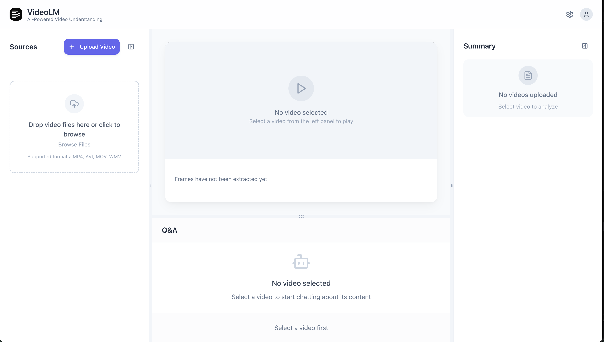
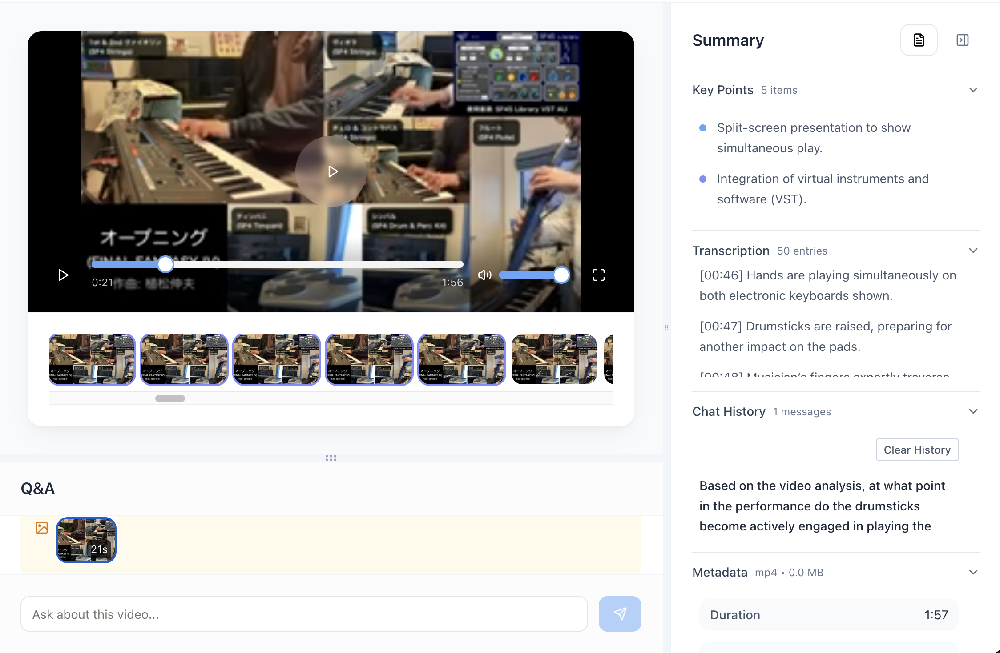
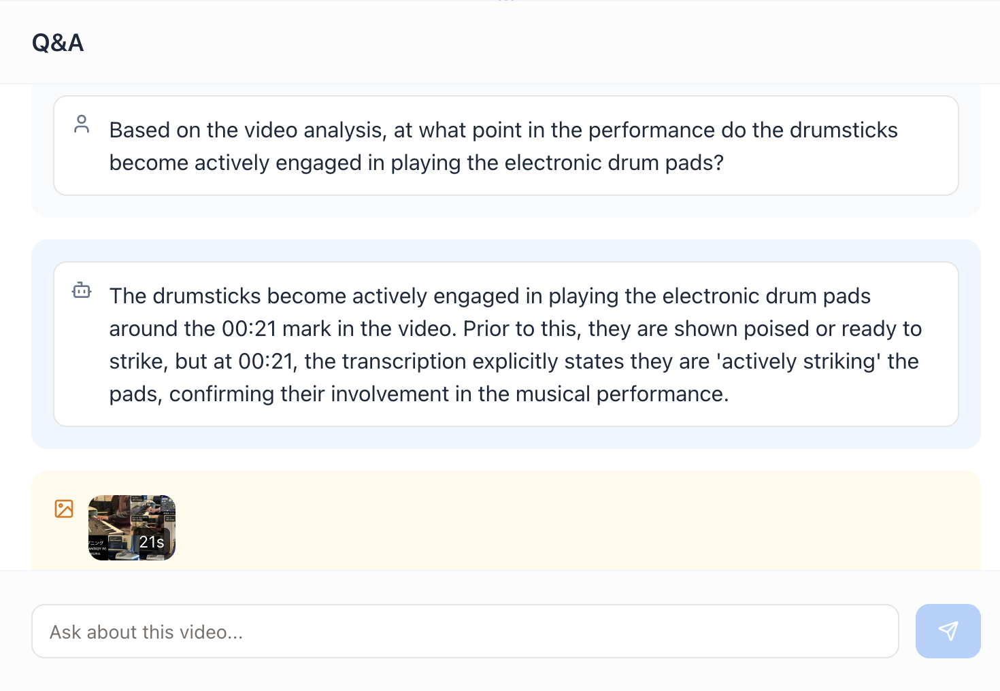

# VideoLM - AI-Powered Video Analysis Platform

A modern web application that leverages AI to analyze video content, extract insights, and enable interactive conversations about video data.

## 🌟 Features

- **Video Upload & Processing**: Support for multiple video formats with automatic frame extraction
- **AI-Powered Analysis**: Intelligent video content analysis using OpenAI-compatible APIs
- **Interactive Chat**: Ask questions about your videos and get contextual responses
- **Multi-language Support**: Japanese and English language support
- **Real-time Processing**: Live progress tracking during video analysis
- **Responsive Design**: Modern, mobile-friendly interface

## 📸 Screenshots

<!-- Add screenshots to docs/screenshots/ folder and update links below -->

### Main Interface

*Video upload and analysis interface*

### Video Analysis Results

*AI-generated video analysis with transcription*

### Interactive Chat

*Ask questions about your video content*

## 🚀 Quick Start

### Prerequisites

- Node.js 20.x or 22.x (managed via nvm)
- npm or yarn
- OpenAI-compatible API access (OpenAI, DataRobot, etc.)

### Installation

1. **Clone the repository**
   ```bash
   git clone <repository-url>
   cd VideoLM
   ```

2. **Install dependencies**
   ```bash
   npm install
   ```

3. **Build the application**
   ```bash
   npm run build
   ```

### Configuration

#### Environment Variables

Set up the following environment variables:

```bash
# For OpenAI
export OPENAI_API_KEY="your-openai-api-key"
export OPENAI_BASE_URL="https://api.openai.com/v1"  # Optional, defaults to OpenAI
export OPENAI_MODEL="gpt-4.1-mini"          # Optional

# For DataRobot (OpenAI-compatible)
export DATAROBOT_API_TOKEN="your-datarobot-token"
export DATAROBOT_ENDPOINT="https://app.datarobot.com/api/v2"
```

### Running the Application

#### Option 1: Standard Node.js Setup
```bash
# Switch to Node.js 20
nvm use 20

# Set environment variables and start
export OPENAI_API_KEY="your-api-key"
PORT=8888 npm start
```

#### Option 2: DataRobot Setup (Recommended)
```bash
# Use the provided startup script
nvm use 20 && \
DATAROBOT_API_TOKEN="$DATAROBOT_API_TOKEN" \
DATAROBOT_ENDPOINT="$DATAROBOT_ENDPOINT" \
PORT=8888 \
./infra/custom_application/start-app.sh
```

#### Option 3: Development Mode
```bash
nvm use 20
npm run dev
```

## 🏗️ Architecture

### Tech Stack

- **Frontend**: React + TypeScript + Vite
- **Backend**: Node.js + Express
- **AI Integration**: OpenAI-compatible APIs
- **Video Processing**: FFmpeg
- **Styling**: Tailwind CSS
- **Build Tools**: Vite + esbuild

### Project Structure

```
VideoLM/
├── client/                 # React frontend
│   ├── src/
│   │   ├── components/     # React components
│   │   ├── hooks/         # Custom React hooks
│   │   └── types/         # TypeScript definitions
├── server/                # Node.js backend
│   ├── services/          # Business logic
│   └── index.ts          # Express server
├── infra/                 # Infrastructure scripts
│   └── custom_application/
├── docs/                  # Documentation
│   └── screenshots/       # Application screenshots
├── dist/                  # Built application
└── uploads/              # Video storage (runtime)
```

## 🔧 Development

### Available Scripts

- `npm run dev` - Start development server with hot reload
- `npm run build` - Build for production
- `npm start` - Start production server
- `npm run lint` - Run ESLint
- `npm run type-check` - Run TypeScript type checking

### Adding Screenshots

1. Take screenshots of your application
2. Save them in the `docs/screenshots/` folder
3. Update the image links in this README
4. Use descriptive filenames (e.g., `main-interface.png`, `analysis-results.png`)

### API Endpoints

- `POST /api/videos/upload` - Upload and analyze video
- `GET /api/videos` - List processed videos
- `GET /api/videos/:id` - Get video analysis
- `POST /api/videos/:id/chat` - Chat about video content
- `GET /api/videos/:id/frames/:frame` - Get video frame
- `GET /api/videos/:id/file` - Download video file

## 🌐 Deployment

### DataRobot Custom Application

This application is designed to work with DataRobot's Custom Application platform:

1. The `infra/custom_application/start-app.sh` script handles environment setup
2. Environment variables are automatically configured for DataRobot's GenAI LLM Gateway
3. The application uses OpenAI-compatible APIs through DataRobot's endpoint

### Manual Deployment

1. Build the application: `npm run build`
2. Set environment variables
3. Start with: `node dist/index.js`
4. Ensure FFmpeg is available in the system PATH

## 🛠️ Troubleshooting

### Common Issues

1. **Node.js Version Issues**
   - Use Node.js 20.x or 22.x (not 23.x)
   - Run `nvm use 20` before starting

2. **API Connection Issues**
   - Verify `OPENAI_BASE_URL` is set correctly (not `OPENAI_API_BASE_URL`)
   - Check API key format and permissions

3. **Port Conflicts**
   - Default port is 5000, use `PORT=8888` for alternative
   - Kill existing processes: `lsof -ti:5000 | xargs kill -9`

4. **Video Processing Issues**
   - Ensure FFmpeg is installed and in PATH
   - Check video format compatibility

### Debug Mode

The startup script includes debug output for environment variables:

```bash
🔧 Environment Variables Debug:
DATAROBOT_API_TOKEN: NWU3MDNjNz...
DATAROBOT_ENDPOINT: https://app.datarobot.com/api/v2
OPENAI_API_KEY: NWU3MDNjNz...
OPENAI_BASE_URL: https://app.datarobot.com/api/v2/genai/llmgw
OPENAI_MODEL: vertex_ai/gemini-2.5-flash
```

## 📝 License

[Add your license information here]

## 🤝 Contributing

[Add contribution guidelines here]

---

*For more detailed documentation, check the `/docs` folder or contact the development team.*
